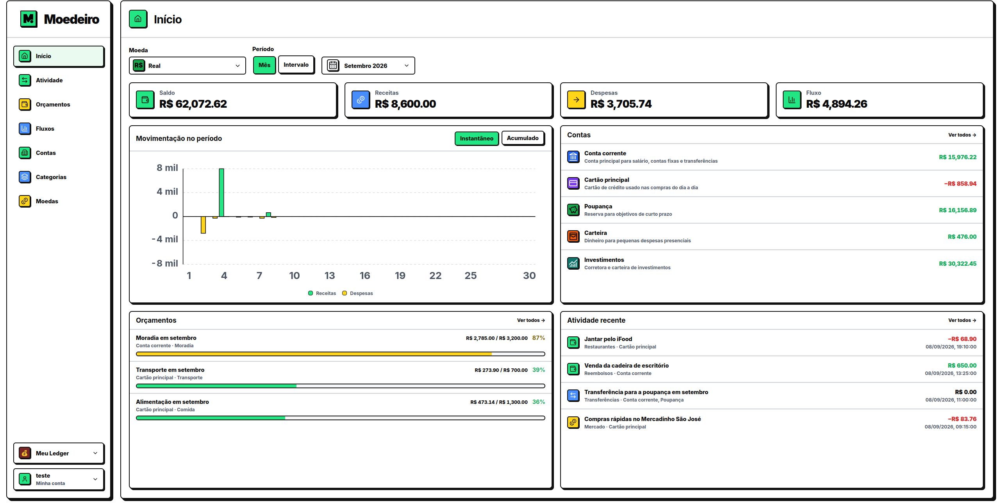
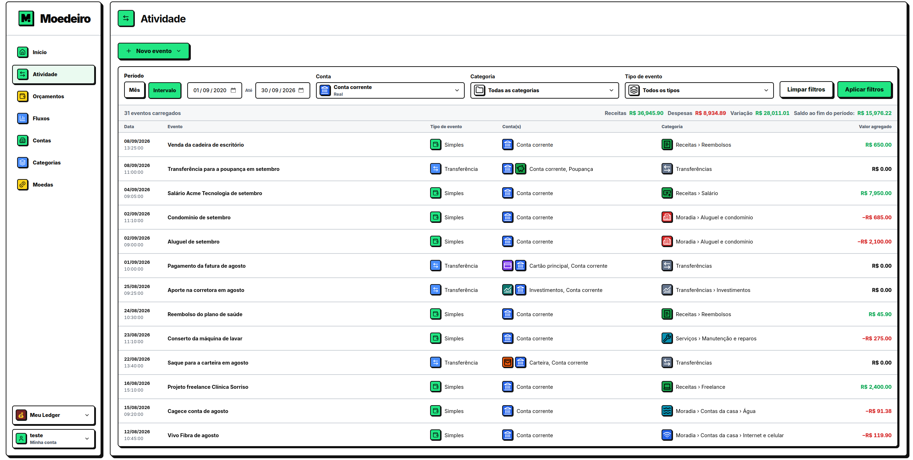
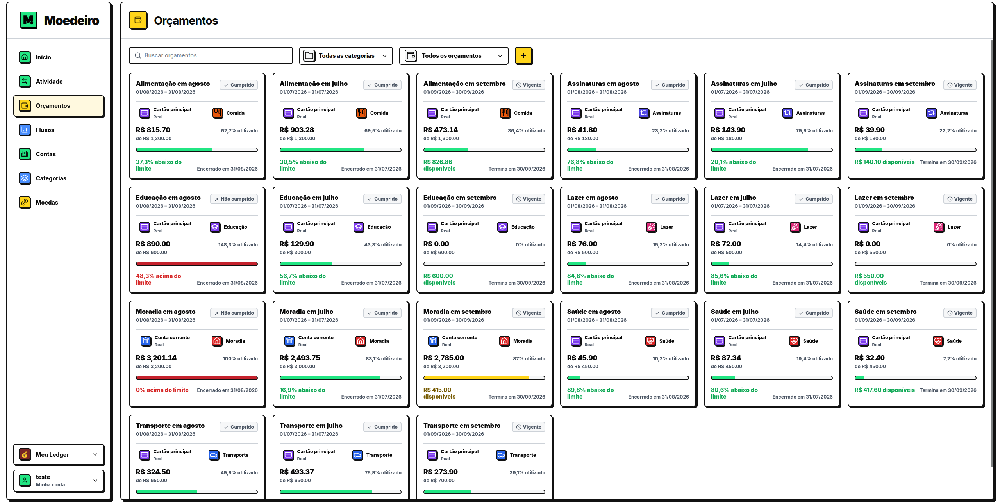
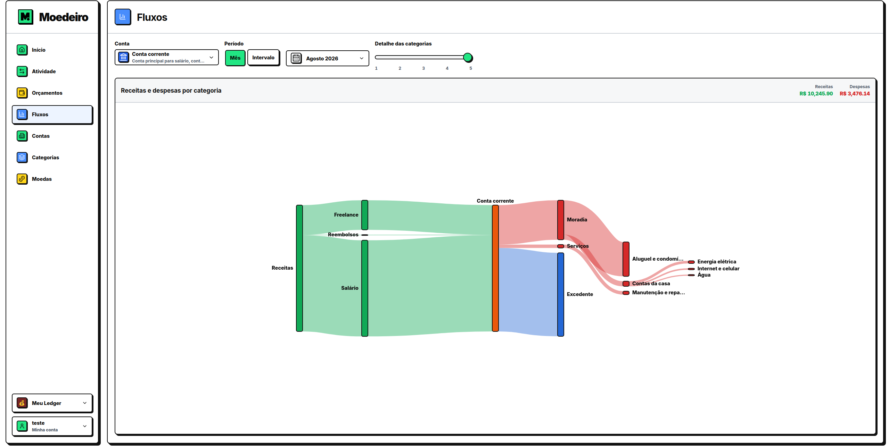

  
  <h1>Moedeiro</h1>
  
<strong>Personal finance records, under your control.</strong>

Moedeiro turns everyday financial records into a clear view of your financial life. Track accounts in multiple currencies, organize every movement, set budgets, and understand where your money goes.

Built for people who want the polish of a modern finance app with the control of self hosting.

## Activity

Record simple entries, itemized shopping lists and transfers between accounts. Powerful filters make it easy to find any movement by period, account, category or event type.

## Budgets

Turn intentions into visible limits. Moedeiro follows real spending across category trees, highlights budgets that need attention and keeps completed periods available for comparison.

## Cash flow

The interactive flow view transforms income and expenses into a visual map. Understand which categories shape your month and see the surplus left after spending.

## Features

* Multiple accounts and currencies
* Hierarchical categories with custom icons and colors
* Simple transactions, detailed shopping lists and account transfers
* Custom period budgets
* Balance history, cash flow analysis and Sankey visualization
* Multilingual interface in Portuguese and English
* International date, time, number and timezone preferences
* Light and dark themes
* Private access with server side sessions and optional TOTP protection

## Data ownership

Moedeiro runs as one compact FastAPI service and stores data in SQLite. User access and ledger ownership live in a registry database, while each ledger has its own independent database. This keeps financial datasets portable, easy to back up and isolated from one another.

## Get started

Start with the [installation guide](docs/installation.md). The remaining documentation covers everything needed to operate and understand the service:

* [Environment variables](docs/environment.md)
* [Reverse proxy](docs/reverse-proxy.md)
* [Administrative CLI](docs/cli.md)
* [Security and concurrency](docs/security.md)
* [Domain model](docs/domain.md)

## Contributing

Bug fixes, tests, documentation, and new translations are welcome. See [CONTRIBUTING.md](CONTRIBUTING.md) for development setup, testing commands, and pull request guidance.

## Third party assets

Language flag graphics are provided by [Twemoji](https://github.com/jdecked/twemoji), licensed under [CC BY 4.0](https://creativecommons.org/licenses/by/4.0/).
